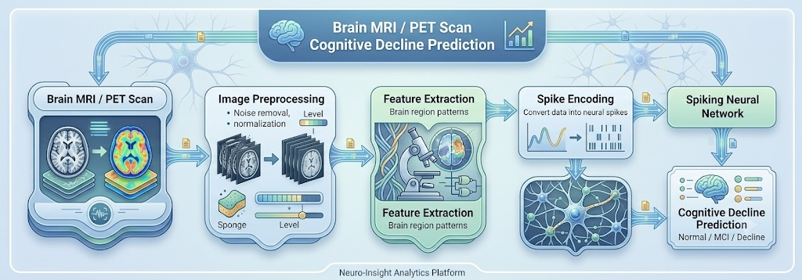

# NeuroGuard

## Brain-Inspired Cognitive Decline Detection System

NeuroGuard is a neuromorphic healthcare solution that leverages Spiking Neural Networks (SNNs) to identify early signs of cognitive decline.

The system analyzes cognitive and clinical assessment data, detects potential decline patterns, and provides explainable risk predictions through an interactive dashboard.

---

## Problem

Early cognitive decline often remains undetected until symptoms become severe. Existing diagnostic approaches can be expensive, time-consuming, and difficult to interpret.

---

## Solution

NeuroGuard uses brain-inspired Spiking Neural Networks (SNNs) to:

- Detect cognitive decline patterns
- Classify patient risk levels
- Provide explainable predictions
- Support healthcare decision-making

---

## Features

- Brain-inspired Neuromorphic AI
- Spiking Neural Networks (SNNs)
- Early Cognitive Decline Detection
- Explainable AI
- Risk Classification
- Interactive Dashboard

---

## Workflow

Patient Data
→ Data Preprocessing
→ Spike Encoding
→ Spiking Neural Network
→ Risk Prediction
→ Explainability Layer
→ Dashboard Output

---

## Impact

NeuroGuard enables earlier diagnosis, assists clinicians in decision-making, and supports proactive healthcare intervention.